STAT 6348 Applied Multivariate Analysis Project 1
================
John Kenney
2024-02-16


**Question 1**

Consider the HCV data. The data set contains laboratory values of blood
donors and Hepatitis C patients (including its progress - ‘just’
Hepatitis C, Fibrosis, Cirrhosis) and demographic values age and sex.
The variables in the dataset are the following:

The laboratory data are the attributes/variables 5-14.

1)  X (Patient ID/No.)  
2)  Category (diagnosis): ‘0=Blood Donor’, ‘1=Hepatitis’, ‘2=Fibrosis’,
    ‘3=Cirrhosis’  
3)  Age (in years)  
4)  Sex (f, m)  
5)  ALB  
6)  ALP  
7)  ALT  
8)  AST  
9)  BIL  
10) CHE  
11) CHOL  
12) CREA  
13) GGT  
14) PROT

**Question 1a)**

Calculate Mahalanobis distances of each observation vector (with
laboratory variables only) to the center in terms of the covariance
matrix. Report only the summary statistics of the distances. Which
patients are nearest and furthest to the center and how do they compare?
How would these results change if Euclidean distance was used instead?

**Question 1a Answer)**

Patient 325 is the closest to the center based on mahalanobis distance
and Patient 570 is the furthest away from the center. We can see that
Patient 325’s distance is 0.7105 and Patient 570’s distance is 19.8253
therefore there seems a large difference between these two patients. If
we look at both patients data Patient 325 is a Blood Donor, 33 years
old, and female and Patient 570 has a diagnosis of Cirrhosis, 46 years
old, and Male, so it makes sense that their lab work would be far apart.

The patient closest to the center based on Euclidean distance is Patient
465 and the patient furthest away from the center Patient 570 did not
change with the different distance metric used.

**Question 1b)**

What are the directions and half-lengths of the two longest axes of the
ellipsoid?

**Question 1b Answer)**  
$(X - \overline{X})^\top \Sigma^{-1}(X - \overline{X}) \le c^2$

The half-length of the largest axis (major) is
$c\sqrt{\lambda_1} = c\times\sqrt{3590.537} = c \times 59.92109$ from
the origin $\overline{X}$ in the direction of the vector
$e_1 = [0.015621802, -0.2240444617, -0.0846236613, -0.3032719000, -0.0710508473,$  
$0.0039750179,  0.0005335915, -0.3245507772, -0.8602402464,  0.0037725469]$

If large sample theory holds we can use
$c = \sqrt{\chi^2_p(\alpha)} = \sqrt{\chi^2_{10}(0.95)} = \sqrt{18.30704} = 4.278673$.
Then the largest half-length would be 256.3827.

The half-length of the second largest axis (minor) is
$c\sqrt{\lambda_2} = c\times\sqrt{2476.81} = c \times 49.76756$ from the
origin $\overline{X}$ in the direction of the vector
$e_2 = [0.0081947233, -0.0044550145, -0.0637826732, -0.1980907922,$  
$-0.0326184499,  0.0017948186, -0.0006255074,  0.9383531779, -0.2739091658, -0.0020771672$

If large sample theory holds we can use
$c = \sqrt{\chi^2_p(\alpha)} = \sqrt{\chi^2_{10}(0.95)} = \sqrt{18.30704} = 4.278673$.
Then the second largest half-length would be 212.9391.

**Question 1c)**

For laboratory variables, calculate sample mean vector, covariance
matrix, and correlation matrix. Create a correlation heatmap in which
intensity of colors reflects the strength of correlation. Add a legend
to the heatmap.

**Question 1c Answer)**  
Refer to the output section for Question 1c) answer.

**Question 1d)**

Make a scatterplot matrix of laboratory variables by labeling the points
using different colors/symbols for different categories (add a legend).
In the diagonal cells of this matrix, add QQ plot of each variable.
Comment on the pairwise relationships between variables based on the
scatterplots and heatmap. Which pairs of variables are useful in
distinguishing between different categories and how?

**Question 1d Answer)**

The Variables PROT and ALB have the strongest correlation and is
positive. These two variables also seem to have a a good linear
relationship. The variable CREA seems to have many large outliers that
may hide the true correlation and pairwise relationships to the other
variables. The variable GGT has a fairly strong correlation and linear
relationship with the variables ALP and AST. The strongest negative
correlation is between BIL and CHE, but from the scatter plot this may
be do to the outliers in category 3 (Cirrhosis). Lastly the last two
pairwise relationship that jumps out to me is CHOL and CHE with a
positive correlation of 0.43.

The variables CHE and BIL look like they may be good to distinguish
between variables because they both seem to be roughly separated. AST
may be another variable that could be used to differentiate the
categories because the groups linear regression lines are not parallel.

**Question 1e)**

For each laboratory variable, make side-by-side box plots for each
category. Put the plots for all attribute variables in one page. Comment
on the marginal distributions based on the different levels of the
category variable.

**Question 1e Answer)**

For the Variable ALB Category 0 (Blood donor) the marginal distribution
looks to be symmetrix with many outliers, Category 1 (Hepatitis) the
marginal distribution looks to be skewed to the right, category 2
(Fibrosis) the marginal distribution looks to be symmetric, and lastly
Category 3 (Cirrhosis) the marginal distribution looks to be slightly
skewed the left.

For the Variable ALP Category 0 (Blood donor) the marginal distribution
looks to be roughly symmetric but there seems to be outliers to the
right indicating a longer right tail, Category 1 (Hepatitis) the
marginal distribution looks to be roughly symmetric with bigger outlier
to the right which may indicate left skewness, category 2 (Fibrosis) the
marginal distribution looks to be slightly skewed to the left because
the median is to the right, and lastly Category 3 (Cirrhosis) the
marginal distribution looks to be roughly symmetric but has large
outliers to the right.

For the Variable ALT Category 0 (Blood donor) the marginal distribution
looks to be skewed to the left because there are multiple outliers to
the left, Category 1 (Hepatitis) the marginal distribution looks to be
heavily left skewed because the median is close the lower quantile,
category 2 (Fibrosis) the marginal distribution looks to be skewed to
left in a lesser degree, and lastly Category 3 (Cirrhosis) the marginal
distribution looks to be skewed to the left and has many outliers to the
right tail.

For the Variable AST Category 0 (Blood donor) the marginal distribution
looks to be roughly symmetric but has many outliers to the right that
may indicate a longer tail to the right, Category 1 (Hepatitis) the
marginal distribution looks to be skewed to the left because the median
is close to the lower quantile, category 2 (Fibrosis) the marginal
distribution looks to be the same but to lesser degree compared to
Category 1, and lastly Category 3 (Cirrhosis) the marginal distribution
looks to be symmetric but has a longer right tail.

For the Variable BIL Category 0 (Blood donor) the marginal distribution
looks to have a long right tail because there are many outliers to the
right, Category 1 (Hepatitis) the marginal distribution looks to be
roughly symmetric but has two outliers giving a longer tail to the
right, category 2 (Fibrosis) the marginal distribution looks to be
skewed to the right because the median is to the left and there is an
outlier to the right tail, and lastly Category 3 (Cirrhosis) the
marginal distribution looks to be skewed to the left because the median
is to the left and there are two large outliers on the right side.

For the Variable CHE Category 0 (Blood donor) the marginal distribution
looks to be symmetric with a couple outliers on the right side, Category
1 (Hepatitis) the marginal distribution looks to be heavily skewed to
the right, category 2 (Fibrosis) the marginal distribution looks to be
skewed to the right but to a lesser degree in comparison with Category
1, and lastly Category 3 (Cirrhosis) the marginal distribution looks to
be skewed to the left with the median fairly close to the lower
quantile.

For the Variable CHOL Category 0 (Blood donor) the marginal distribution
looks to be symmetric but has a large spread and many outliers to the
right, Category 1 (Hepatitis) the marginal distribution looks to be
symmetric and has one large outlier to the right, category 2 (Fibrosis)
the marginal distribution looks to have a heavier tail to the right, and
lastly Category 3 (Cirrhosis) the marginal distribution looks to be
slightly skewed to the left with outliers on both sides.

For the Variable CREA Category 0 (Blood donor) the marginal distribution
looks to be slightly skewed to the left with outlier to both sides,
Category 1 (Hepatitis) the marginal distribution looks to be symmetric
with an outlier to the right, category 2 (Fibrosis) the marginal
distribution looks to have an outlier to the right , and lastly Category
3 (Cirrhosis) the marginal distribution looks to be hevily skewed to the
left and has an enormous outlier to the right.

For the Variable GGT Category 0 (Blood donor) the marginal distribution
looks to be slightly skewed to the left and has a lot of outliers to the
right side, Category 1 (Hepatitis) the marginal distribution looks to be
left skewed, category 2 (Fibrosis) the marginal distribution looks to be
symmetric, and lastly Category 3 (Cirrhosis) the marginal distribution
looks to be slightly skewed to the left with large outliers to the
right.

For the Variable PROT Category 0 (Blood donor) the marginal distribution
looks to be symmetric but has multiple outliers to the left, Category 1
(Hepatitis) the marginal distribution looks to be slightly skewed to the
left, category 2 (Fibrosis) the marginal distribution looks to be
symmetric, and lastly Category 3 (Cirrhosis) the marginal distribution
looks to be slightly skewed to the right.

**Question 1f)**

Create a panel plot consisting of the following three plots:  
Note: Divide the plotting area into three parts in such a manner that
none of the plots get squeezed/distorted. Make efficient use of the
plotting area in order to minimize white space. Comment on any pattern
observed in the plots.

**Question 1f Answer)**

There seems to be more males that are further away from the center in
the plot between CHE and CHOL. There is also one outlier for age in
category 0 that is a male. The histograms of age grouped by Category 1
and Category 3 are skewed to opposite sides indicating two possible
different subpopulations.

**Question 1g)**

Make a 3D scatterplot of CHE, CHOL, and PROT. Use different colors to
represent different categories. Make another version of the plot by
adding vertical lines that connect the points to the floor. Comment on
the relationship between the three variables and whether it varies by
category.

**Question 1g Answer)**

There Seems to be a clear grouping of Category 3 by itself in the 3d
plot away from the other groups this may be mainly do to the CHE
variable. It is harder to distinguish any other patterns from this view
or angle.

**Question 1h)**

For this and the remaining parts, consider a subset of variables Age,
ALB, CHE, CHOL, and PROT. Check univariate normality assumption (using
all plots and measures discussed in class). If normality appears to be
violated, explore transformations that may help. For each variable,
include only one transformation and the corresponding plot (after
transformation) that appears to be the most helpful.

**Question 1h Answer)**

Transformations applied are as follows:  
AGE -\> $AGE^{1/3}$  
ALB -\> ALB (No transformation applied)  
CHE -\> CHE (No transformation applied)  
CHOL -\> $\sqrt{CHOL}$  
PROT -\> $PROT^{4}$

**Question 1i)**

Retain the transformations found above and check the multivariate
normality assumption and find univariate and multivariate outliers.
Comment about the normality assumption based on previous and this part.

**Question 1i Answer)**

The Chisq plot is not straight so this indicates that the multivariate
normality assumption is violated.

The Observations that are multivariate Outliers : 43 183 209 216 259 287
315 317 344 403 529 531 532 533 545 553 571 574 575 576 581 584 588 589

There are 0 univariate outliers for $Age^{1/3}$. There are 27 univariate
outliers for ALB.  
There are 23 univariate outliers for CHE.  
There are 10 univariate outliers for $\sqrt{CHOL}$.  
There are 19 univariate outliers for $PROT^4$.

***Output***

**Question 1**

**Question 1a)**

<table class="table" style="margin-left: auto; margin-right: auto;">
<caption>
Summary Statistics of Mahalanobis distances
</caption>
<thead>
<tr>
<th style="text-align:center;">
Min
</th>
<th style="text-align:center;">
1st.Quantile
</th>
<th style="text-align:center;">
Median
</th>
<th style="text-align:center;">
Mean
</th>
<th style="text-align:center;">
3rd.Quantile
</th>
<th style="text-align:center;">
Max
</th>
</tr>
</thead>
<tbody>
<tr>
<td style="text-align:center;">
0.7105
</td>
<td style="text-align:center;">
1.6393
</td>
<td style="text-align:center;">
2.0645
</td>
<td style="text-align:center;">
2.5503
</td>
<td style="text-align:center;">
2.697
</td>
<td style="text-align:center;">
19.8253
</td>
</tr>
<tr>
<td style="text-align:center;">
Patient_325
</td>
<td style="text-align:center;">
</td>
<td style="text-align:center;">
Patient_329
</td>
<td style="text-align:center;">
</td>
<td style="text-align:center;">
</td>
<td style="text-align:center;">
Patient_570
</td>
</tr>
</tbody>
</table>
<table class="table" style="margin-left: auto; margin-right: auto;">
<caption>
Summary Statistics of Euclidean distances
</caption>
<thead>
<tr>
<th style="text-align:center;">
Min
</th>
<th style="text-align:center;">
1st.Quantile
</th>
<th style="text-align:center;">
Median
</th>
<th style="text-align:center;">
Mean
</th>
<th style="text-align:center;">
3rd.Quantile
</th>
<th style="text-align:center;">
Max
</th>
</tr>
</thead>
<tbody>
<tr>
<td style="text-align:center;">
0.2335
</td>
<td style="text-align:center;">
22.1565
</td>
<td style="text-align:center;">
46.4065
</td>
<td style="text-align:center;">
64.6809
</td>
<td style="text-align:center;">
76.4265
</td>
<td style="text-align:center;">
1055.6335
</td>
</tr>
<tr>
<td style="text-align:center;">
Patient_465
</td>
<td style="text-align:center;">
</td>
<td style="text-align:center;">
Patient_25
</td>
<td style="text-align:center;">
</td>
<td style="text-align:center;">
</td>
<td style="text-align:center;">
Patient_570
</td>
</tr>
</tbody>
</table>

**Question 1b)**

**Question 1c)**

<table class="table" style="margin-left: auto; margin-right: auto;">
<caption>
Sample Mean Vector of the Laboratory variables
</caption>
<thead>
<tr>
<th style="text-align:right;">
ALB
</th>
<th style="text-align:right;">
ALP
</th>
<th style="text-align:right;">
ALT
</th>
<th style="text-align:right;">
AST
</th>
<th style="text-align:right;">
BIL
</th>
<th style="text-align:right;">
CHE
</th>
<th style="text-align:right;">
CHOL
</th>
<th style="text-align:right;">
CREA
</th>
<th style="text-align:right;">
GGT
</th>
<th style="text-align:right;">
PROT
</th>
</tr>
</thead>
<tbody>
<tr>
<td style="text-align:right;">
41.6243
</td>
<td style="text-align:right;">
68.1231
</td>
<td style="text-align:right;">
26.5754
</td>
<td style="text-align:right;">
33.7728
</td>
<td style="text-align:right;">
11.0182
</td>
<td style="text-align:right;">
8.2036
</td>
<td style="text-align:right;">
5.3913
</td>
<td style="text-align:right;">
81.6691
</td>
<td style="text-align:right;">
38.1985
</td>
<td style="text-align:right;">
71.8902
</td>
</tr>
</tbody>
</table>
<table class="table" style="margin-left: auto; margin-right: auto;">
<caption>
Covariance Matrix of the Laboratory variables
</caption>
<thead>
<tr>
<th style="text-align:left;">
</th>
<th style="text-align:right;">
ALB
</th>
<th style="text-align:right;">
ALP
</th>
<th style="text-align:right;">
ALT
</th>
<th style="text-align:right;">
AST
</th>
<th style="text-align:right;">
BIL
</th>
<th style="text-align:right;">
CHE
</th>
<th style="text-align:right;">
CHOL
</th>
<th style="text-align:right;">
CREA
</th>
<th style="text-align:right;">
GGT
</th>
<th style="text-align:right;">
PROT
</th>
</tr>
</thead>
<tbody>
<tr>
<td style="text-align:left;">
ALB
</td>
<td style="text-align:right;">
33.198
</td>
<td style="text-align:right;">
-21.823
</td>
<td style="text-align:right;">
4.748
</td>
<td style="text-align:right;">
-33.634
</td>
<td style="text-align:right;">
-17.009
</td>
<td style="text-align:right;">
4.556
</td>
<td style="text-align:right;">
1.369
</td>
<td style="text-align:right;">
0.419
</td>
<td style="text-align:right;">
-46.180
</td>
<td style="text-align:right;">
17.589
</td>
</tr>
<tr>
<td style="text-align:left;">
ALP
</td>
<td style="text-align:right;">
-21.823
</td>
<td style="text-align:right;">
671.902
</td>
<td style="text-align:right;">
119.842
</td>
<td style="text-align:right;">
57.101
</td>
<td style="text-align:right;">
26.337
</td>
<td style="text-align:right;">
1.674
</td>
<td style="text-align:right;">
3.684
</td>
<td style="text-align:right;">
202.255
</td>
<td style="text-align:right;">
649.315
</td>
<td style="text-align:right;">
-8.747
</td>
</tr>
<tr>
<td style="text-align:left;">
ALT
</td>
<td style="text-align:right;">
4.748
</td>
<td style="text-align:right;">
119.842
</td>
<td style="text-align:right;">
435.270
</td>
<td style="text-align:right;">
136.221
</td>
<td style="text-align:right;">
-38.784
</td>
<td style="text-align:right;">
10.255
</td>
<td style="text-align:right;">
3.533
</td>
<td style="text-align:right;">
-38.189
</td>
<td style="text-align:right;">
248.910
</td>
<td style="text-align:right;">
1.873
</td>
</tr>
<tr>
<td style="text-align:left;">
AST
</td>
<td style="text-align:right;">
-33.634
</td>
<td style="text-align:right;">
57.101
</td>
<td style="text-align:right;">
136.221
</td>
<td style="text-align:right;">
1080.231
</td>
<td style="text-align:right;">
177.110
</td>
<td style="text-align:right;">
-14.206
</td>
<td style="text-align:right;">
-7.466
</td>
<td style="text-align:right;">
-29.906
</td>
<td style="text-align:right;">
852.707
</td>
<td style="text-align:right;">
3.060
</td>
</tr>
<tr>
<td style="text-align:left;">
BIL
</td>
<td style="text-align:right;">
-17.009
</td>
<td style="text-align:right;">
26.337
</td>
<td style="text-align:right;">
-38.784
</td>
<td style="text-align:right;">
177.110
</td>
<td style="text-align:right;">
302.989
</td>
<td style="text-align:right;">
-12.232
</td>
<td style="text-align:right;">
-3.568
</td>
<td style="text-align:right;">
17.569
</td>
<td style="text-align:right;">
199.031
</td>
<td style="text-align:right;">
-4.895
</td>
</tr>
<tr>
<td style="text-align:left;">
CHE
</td>
<td style="text-align:right;">
4.556
</td>
<td style="text-align:right;">
1.674
</td>
<td style="text-align:right;">
10.255
</td>
<td style="text-align:right;">
-14.206
</td>
<td style="text-align:right;">
-12.232
</td>
<td style="text-align:right;">
4.801
</td>
<td style="text-align:right;">
1.059
</td>
<td style="text-align:right;">
-1.346
</td>
<td style="text-align:right;">
-11.388
</td>
<td style="text-align:right;">
3.590
</td>
</tr>
<tr>
<td style="text-align:left;">
CHOL
</td>
<td style="text-align:right;">
1.369
</td>
<td style="text-align:right;">
3.684
</td>
<td style="text-align:right;">
3.533
</td>
<td style="text-align:right;">
-7.466
</td>
<td style="text-align:right;">
-3.568
</td>
<td style="text-align:right;">
1.059
</td>
<td style="text-align:right;">
1.275
</td>
<td style="text-align:right;">
-2.946
</td>
<td style="text-align:right;">
0.541
</td>
<td style="text-align:right;">
1.480
</td>
</tr>
<tr>
<td style="text-align:left;">
CREA
</td>
<td style="text-align:right;">
0.419
</td>
<td style="text-align:right;">
202.255
</td>
<td style="text-align:right;">
-38.189
</td>
<td style="text-align:right;">
-29.906
</td>
<td style="text-align:right;">
17.569
</td>
<td style="text-align:right;">
-1.346
</td>
<td style="text-align:right;">
-2.946
</td>
<td style="text-align:right;">
2570.185
</td>
<td style="text-align:right;">
345.094
</td>
<td style="text-align:right;">
-8.165
</td>
</tr>
<tr>
<td style="text-align:left;">
GGT
</td>
<td style="text-align:right;">
-46.180
</td>
<td style="text-align:right;">
649.315
</td>
<td style="text-align:right;">
248.910
</td>
<td style="text-align:right;">
852.707
</td>
<td style="text-align:right;">
199.031
</td>
<td style="text-align:right;">
-11.388
</td>
<td style="text-align:right;">
0.541
</td>
<td style="text-align:right;">
345.094
</td>
<td style="text-align:right;">
2948.751
</td>
<td style="text-align:right;">
-10.784
</td>
</tr>
<tr>
<td style="text-align:left;">
PROT
</td>
<td style="text-align:right;">
17.589
</td>
<td style="text-align:right;">
-8.747
</td>
<td style="text-align:right;">
1.873
</td>
<td style="text-align:right;">
3.060
</td>
<td style="text-align:right;">
-4.895
</td>
<td style="text-align:right;">
3.590
</td>
<td style="text-align:right;">
1.480
</td>
<td style="text-align:right;">
-8.165
</td>
<td style="text-align:right;">
-10.784
</td>
<td style="text-align:right;">
28.611
</td>
</tr>
</tbody>
</table>
<table class="table" style="margin-left: auto; margin-right: auto;">
<caption>
Correlation Matrix of the Laboratory variables
</caption>
<thead>
<tr>
<th style="text-align:left;">
</th>
<th style="text-align:right;">
ALB
</th>
<th style="text-align:right;">
ALP
</th>
<th style="text-align:right;">
ALT
</th>
<th style="text-align:right;">
AST
</th>
<th style="text-align:right;">
BIL
</th>
<th style="text-align:right;">
CHE
</th>
<th style="text-align:right;">
CHOL
</th>
<th style="text-align:right;">
CREA
</th>
<th style="text-align:right;">
GGT
</th>
<th style="text-align:right;">
PROT
</th>
</tr>
</thead>
<tbody>
<tr>
<td style="text-align:left;">
ALB
</td>
<td style="text-align:right;">
1.0000
</td>
<td style="text-align:right;">
-0.1461
</td>
<td style="text-align:right;">
0.0395
</td>
<td style="text-align:right;">
-0.1776
</td>
<td style="text-align:right;">
-0.1696
</td>
<td style="text-align:right;">
0.3609
</td>
<td style="text-align:right;">
0.2104
</td>
<td style="text-align:right;">
0.0014
</td>
<td style="text-align:right;">
-0.1476
</td>
<td style="text-align:right;">
0.5707
</td>
</tr>
<tr>
<td style="text-align:left;">
ALP
</td>
<td style="text-align:right;">
-0.1461
</td>
<td style="text-align:right;">
1.0000
</td>
<td style="text-align:right;">
0.2216
</td>
<td style="text-align:right;">
0.0670
</td>
<td style="text-align:right;">
0.0584
</td>
<td style="text-align:right;">
0.0295
</td>
<td style="text-align:right;">
0.1259
</td>
<td style="text-align:right;">
0.1539
</td>
<td style="text-align:right;">
0.4613
</td>
<td style="text-align:right;">
-0.0631
</td>
</tr>
<tr>
<td style="text-align:left;">
ALT
</td>
<td style="text-align:right;">
0.0395
</td>
<td style="text-align:right;">
0.2216
</td>
<td style="text-align:right;">
1.0000
</td>
<td style="text-align:right;">
0.1987
</td>
<td style="text-align:right;">
-0.1068
</td>
<td style="text-align:right;">
0.2243
</td>
<td style="text-align:right;">
0.1500
</td>
<td style="text-align:right;">
-0.0361
</td>
<td style="text-align:right;">
0.2197
</td>
<td style="text-align:right;">
0.0168
</td>
</tr>
<tr>
<td style="text-align:left;">
AST
</td>
<td style="text-align:right;">
-0.1776
</td>
<td style="text-align:right;">
0.0670
</td>
<td style="text-align:right;">
0.1987
</td>
<td style="text-align:right;">
1.0000
</td>
<td style="text-align:right;">
0.3096
</td>
<td style="text-align:right;">
-0.1973
</td>
<td style="text-align:right;">
-0.2012
</td>
<td style="text-align:right;">
-0.0179
</td>
<td style="text-align:right;">
0.4778
</td>
<td style="text-align:right;">
0.0174
</td>
</tr>
<tr>
<td style="text-align:left;">
BIL
</td>
<td style="text-align:right;">
-0.1696
</td>
<td style="text-align:right;">
0.0584
</td>
<td style="text-align:right;">
-0.1068
</td>
<td style="text-align:right;">
0.3096
</td>
<td style="text-align:right;">
1.0000
</td>
<td style="text-align:right;">
-0.3207
</td>
<td style="text-align:right;">
-0.1816
</td>
<td style="text-align:right;">
0.0199
</td>
<td style="text-align:right;">
0.2106
</td>
<td style="text-align:right;">
-0.0526
</td>
</tr>
<tr>
<td style="text-align:left;">
CHE
</td>
<td style="text-align:right;">
0.3609
</td>
<td style="text-align:right;">
0.0295
</td>
<td style="text-align:right;">
0.2243
</td>
<td style="text-align:right;">
-0.1973
</td>
<td style="text-align:right;">
-0.3207
</td>
<td style="text-align:right;">
1.0000
</td>
<td style="text-align:right;">
0.4280
</td>
<td style="text-align:right;">
-0.0121
</td>
<td style="text-align:right;">
-0.0957
</td>
<td style="text-align:right;">
0.3063
</td>
</tr>
<tr>
<td style="text-align:left;">
CHOL
</td>
<td style="text-align:right;">
0.2104
</td>
<td style="text-align:right;">
0.1259
</td>
<td style="text-align:right;">
0.1500
</td>
<td style="text-align:right;">
-0.2012
</td>
<td style="text-align:right;">
-0.1816
</td>
<td style="text-align:right;">
0.4280
</td>
<td style="text-align:right;">
1.0000
</td>
<td style="text-align:right;">
-0.0515
</td>
<td style="text-align:right;">
0.0088
</td>
<td style="text-align:right;">
0.2450
</td>
</tr>
<tr>
<td style="text-align:left;">
CREA
</td>
<td style="text-align:right;">
0.0014
</td>
<td style="text-align:right;">
0.1539
</td>
<td style="text-align:right;">
-0.0361
</td>
<td style="text-align:right;">
-0.0179
</td>
<td style="text-align:right;">
0.0199
</td>
<td style="text-align:right;">
-0.0121
</td>
<td style="text-align:right;">
-0.0515
</td>
<td style="text-align:right;">
1.0000
</td>
<td style="text-align:right;">
0.1254
</td>
<td style="text-align:right;">
-0.0301
</td>
</tr>
<tr>
<td style="text-align:left;">
GGT
</td>
<td style="text-align:right;">
-0.1476
</td>
<td style="text-align:right;">
0.4613
</td>
<td style="text-align:right;">
0.2197
</td>
<td style="text-align:right;">
0.4778
</td>
<td style="text-align:right;">
0.2106
</td>
<td style="text-align:right;">
-0.0957
</td>
<td style="text-align:right;">
0.0088
</td>
<td style="text-align:right;">
0.1254
</td>
<td style="text-align:right;">
1.0000
</td>
<td style="text-align:right;">
-0.0371
</td>
</tr>
<tr>
<td style="text-align:left;">
PROT
</td>
<td style="text-align:right;">
0.5707
</td>
<td style="text-align:right;">
-0.0631
</td>
<td style="text-align:right;">
0.0168
</td>
<td style="text-align:right;">
0.0174
</td>
<td style="text-align:right;">
-0.0526
</td>
<td style="text-align:right;">
0.3063
</td>
<td style="text-align:right;">
0.2450
</td>
<td style="text-align:right;">
-0.0301
</td>
<td style="text-align:right;">
-0.0371
</td>
<td style="text-align:right;">
1.0000
</td>
</tr>
</tbody>
</table>

<div class="figure" style="text-align: center">

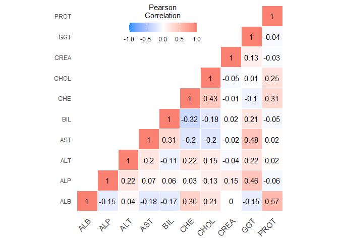
<p class="caption">
Correlation Heatmap for Laboratory Variables
</p>

</div>

**Question 1d)**

<div class="figure" style="text-align: left">

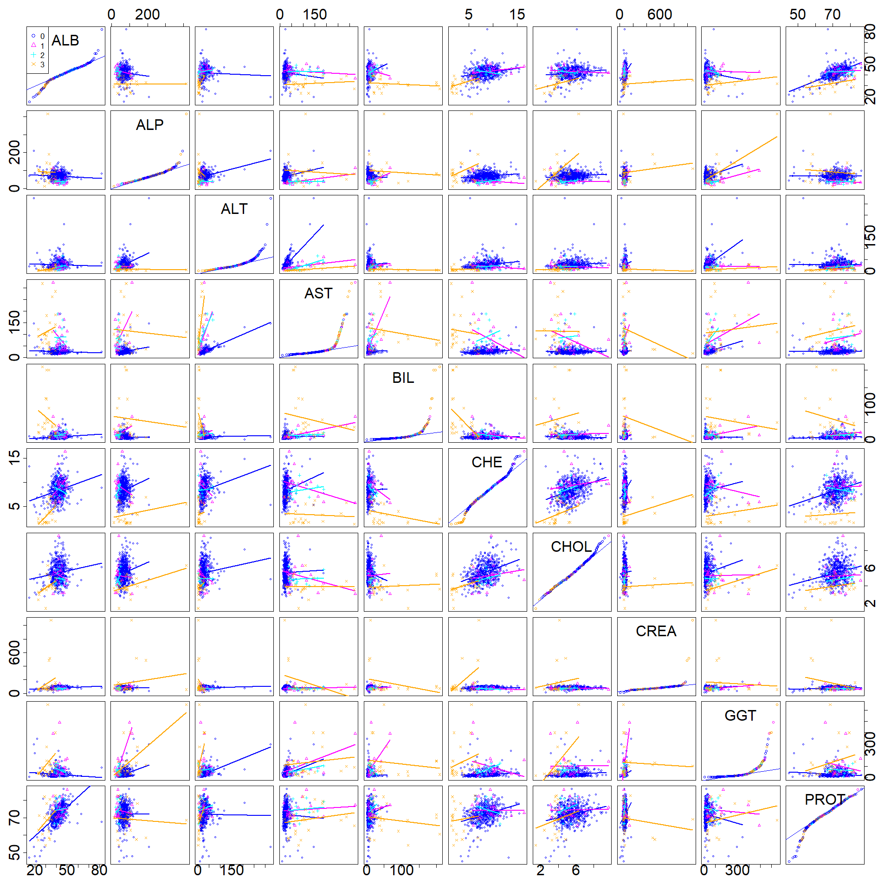
<p class="caption">
Scatterplot Matrix with QQ-plot on the Diagonal for Laboratory Variables
</p>

</div>

**Question 1e)**

<div class="figure" style="text-align: center">

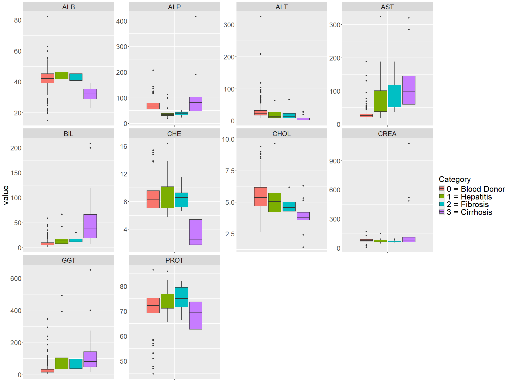
<p class="caption">
Laboratory Box plots for each Category
</p>

</div>

**Question 1f)**

<div class="figure" style="text-align: center">

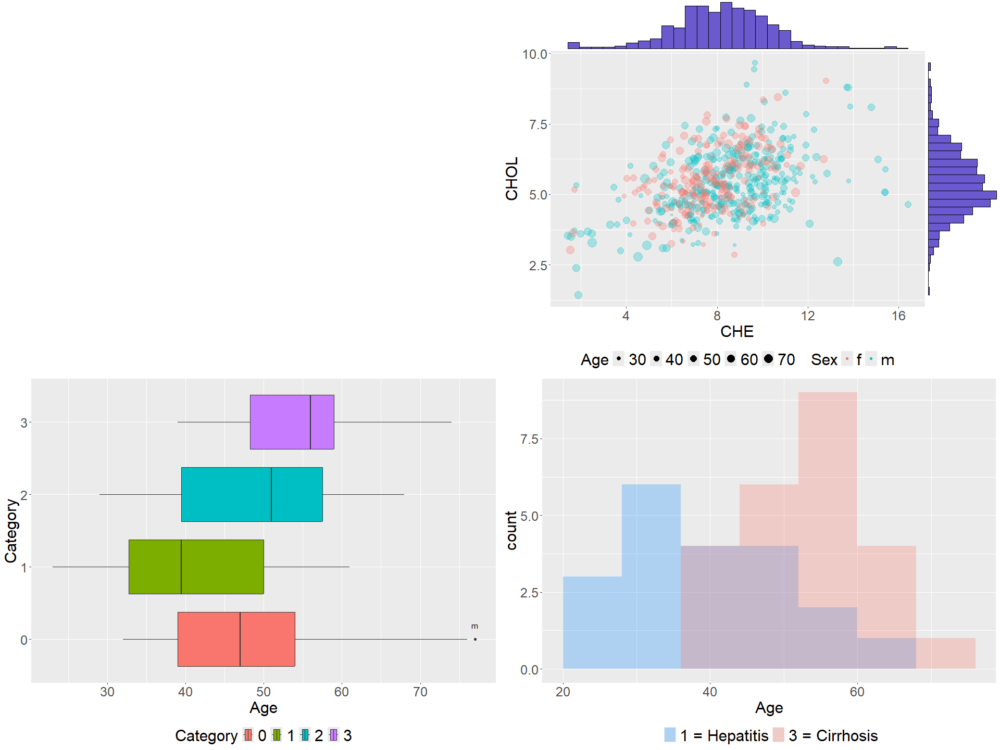
<p class="caption">
3 different graphs
</p>

</div>

**Question 1g)**

<div class="figure" style="text-align: center">

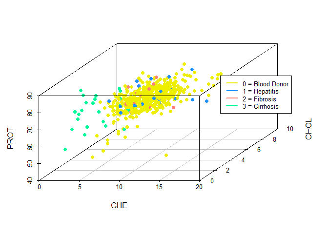
<p class="caption">
3d Scatter plot of CHE, CHOL, and PROT grouped by Category
</p>

</div>

<div class="figure" style="text-align: center">

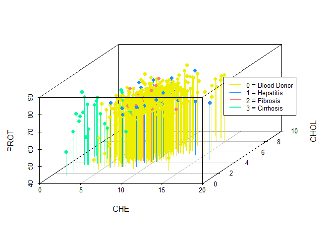
<p class="caption">
3d Scatter plot of CHE, CHOL, and PROT grouped by Category with vertical
lines
</p>

</div>

**Question 1h)**

<div class="figure" style="text-align: center">

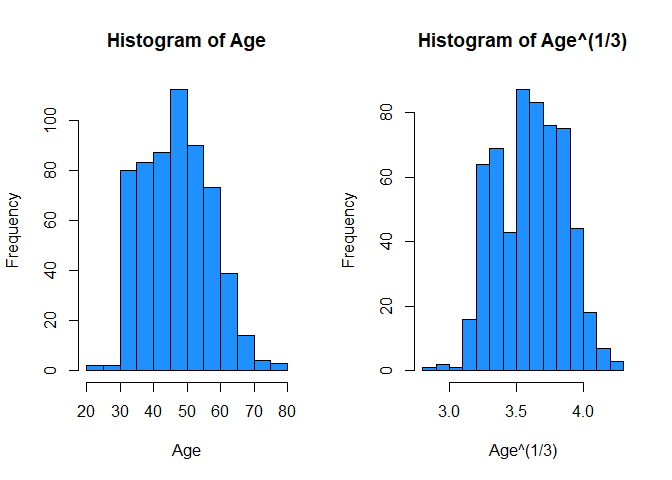
<p class="caption">
Transformation of $Age^{1/3}$ applied
</p>

</div>

<div class="figure" style="text-align: center">

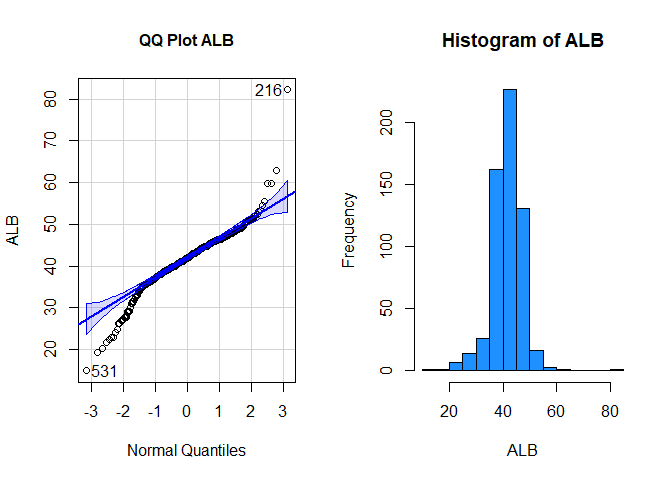
<p class="caption">
No transformation applied for ALB
</p>

</div>

<div class="figure" style="text-align: center">

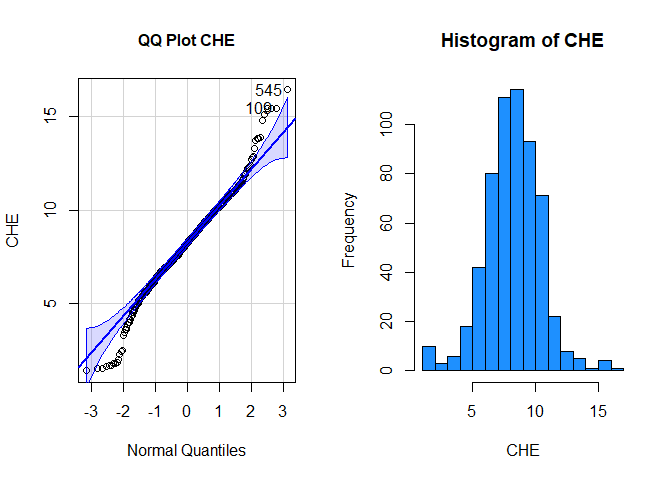
<p class="caption">
No Tranformation applied to CHE
</p>

</div>

<div class="figure" style="text-align: center">

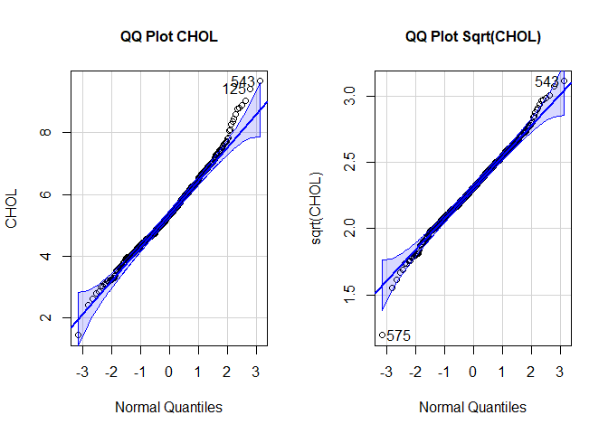
<p class="caption">
Transformation applied is $\sqrt{CHOL}$
</p>

</div>

<div class="figure" style="text-align: center">

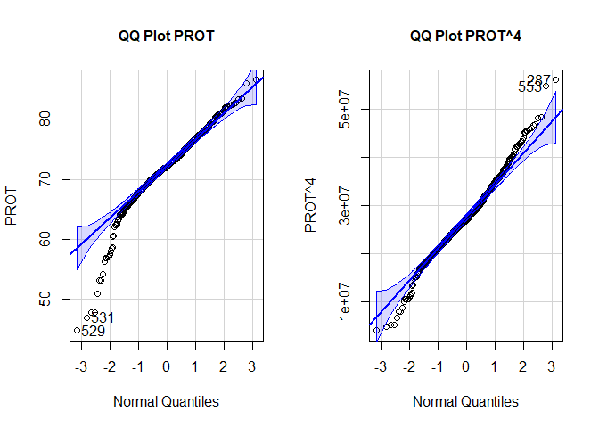
<p class="caption">
Transformation applied is $PROT^4$
</p>

</div>

**Question 1i)**

    ## [1] "Observations that are multivariate Outliers"
    ##  [1]  43 183 209 216 259 287 315 317 344 403 529 531 532 533 545 553 571 574 575
    ## [20] 576 581 584 588 589

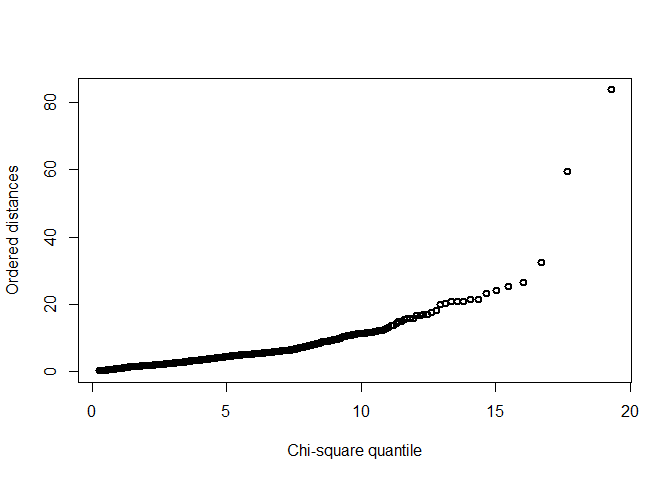<!-- -->

    ## [1] 0

    ## [1] 27

    ## [1] 23

    ## [1] 10

    ## [1] 19

***CODE***

``` r
#HCV <- read.csv("https://utdallas.box.com/shared/static/6noqrx35iao10p4w15z7kx6egggiiq8f.csv")
HCV <- read.csv("Project_1_multivariate_analysis_and_assumptions/Data/HCV.csv")
HCV$Category <- factor(HCV$Category)
tmp <- HCV
HCV$Sex <- factor(HCV$Sex)
```

**Question 1**

``` r
HCV_num <- subset(HCV,select =-c(Category,Age,Sex))
#head(HCV_num)
```

**Question 1a)**

``` r
#Calculate Mahalanobis Distances
maha.dist<- sqrt(mahalanobis(HCV_num,center=colMeans(HCV_num),cov=cov(HCV_num)))
names(maha.dist) <- paste("Patient_",1:(dim(HCV_num)[1]),sep="")
#Sort the Distances
#sort(maha.dist)

# mahalanobis distance summary
maha.summary <- summary(maha.dist)
dig <- 4
table.maha.summary <- as.data.frame(
  cbind(round(maha.summary[[1]],dig), round(maha.summary[[2]],dig), round(maha.summary[[3]],dig), 
        round(maha.summary[[4]],dig), round(maha.summary[[5]],dig), round(maha.summary[[6]],dig)))
colnames(table.maha.summary) <- c("Min","1st.Quantile","Median","Mean","3rd.Quantile","Max")
table.maha.summary <- rbind(table.maha.summary,
                            c(names(which(maha.dist == min(maha.dist))), "", names(which(maha.dist == median(maha.dist))), "", "", names(which(maha.dist == max(maha.dist)))))

# kable extratable creation
library(kableExtra)
knitr::kable(table.maha.summary,booktabs = T, 
             caption = "Summary Statistics of Mahalanobis distances", 
             align = "cccccc") %>% 
  kable_styling(latex_options = c("hold_position"))
```

``` r
# to look at patient 325 and 570
#HCV[c(325,570),]

library(gridExtra)
```

``` r
# euclidean function
euclidean <- function(x) {
  dist <- sqrt(rowSums(x -  colMeans(x))^2)
  return(dist)
}

#Calculate Mahalanobis Distances
euclidean.dist <- euclidean(HCV_num)
names(euclidean.dist) <- paste("Patient_",1:(dim(HCV_num)[1]),sep="")
#Sort the Distances
#sort(euclidean.dist)

# euclidean distance summary
euclidean.summary <- summary(euclidean.dist)
dig <- 4
table.euclidean.summary <- as.data.frame(
  cbind(round(euclidean.summary[[1]],dig), round(euclidean.summary[[2]],dig), round(euclidean.summary[[3]],dig), 
        round(euclidean.summary[[4]],dig), round(euclidean.summary[[5]],dig), round(euclidean.summary[[6]],dig)))
colnames(table.euclidean.summary) <- c("Min","1st.Quantile","Median","Mean","3rd.Quantile","Max")
table.euclidean.summary <- rbind(table.euclidean.summary,
                            c(names(which(euclidean.dist == min(euclidean.dist))), "", names(which(euclidean.dist == median(euclidean.dist))), "", "", names(which(euclidean.dist == max(euclidean.dist)))))

# kable extratable creation
library(kableExtra)
knitr::kable(table.euclidean.summary,booktabs = T, 
             caption = "Summary Statistics of Euclidean distances", 
             align = "cccccc") %>% 
  kable_styling(latex_options = c("hold_position"))
```

**Question 1b)**

``` r
# covariance matrix

# X <- as.matrix(HCV_num)
# (t(X) %*% (diag(dim(X)[1]) - (1/dim(X)[1])*matrix(1,nrow = dim(X)[1],ncol = dim(X)[1])) %*% X)*(1/(dim(X)[1]-1))
S <- cov(HCV_num,method = "pearson")

# get two largest eigen pairs of of the ellipsoid
#eigen(S)
lam1 <- eigen(S)$values[1]
e1 <- eigen(S)$vectors[,1]
lam2 <- eigen(S)$values[2]
e2 <- eigen(S)$vectors[,2]
```

**Question 1c)**

``` r
# sample mean vector
xbar <- colMeans(HCV_num)

dig <- 4

# kable extratable creation
library(kableExtra)
knitr::kable(round(t(xbar),dig),booktabs = T, 
             caption = "Sample Mean Vector of the Laboratory variables") %>% 
  kable_styling(latex_options = c("hold_position"))
```

``` r
# covariance matrix

# X <- as.matrix(HCV_num)
# (t(X) %*% (diag(dim(X)[1]) - (1/dim(X)[1])*matrix(1,nrow = dim(X)[1],ncol = dim(X)[1])) %*% X)*(1/(dim(X)[1]-1))
S <- cov(HCV_num,method = "pearson")


dig <- 3

# kable extra table creation
library(kableExtra)
knitr::kable(round(S,dig),booktabs = T, 
             caption = "Covariance Matrix of the Laboratory variables") %>% 
  kable_styling(latex_options = c("hold_position","center"))
```

``` r
# correlation matrix
r <- cor(HCV_num,method = "pearson")

dig <- 4

# kable extra table creation
library(kableExtra)
knitr::kable(round(r,dig),booktabs = T, 
             caption = "Correlation Matrix of the Laboratory variables") %>% 
  kable_styling(latex_options = c("hold_position"))
```

``` r
# melt the rounded corr mat for plotting
library(reshape2)
r[lower.tri(r)] <- NA
melted_cormat <- melt(round(r,2),na.rm = T)

library(ggplot2)
ggheatmap <- ggplot(melted_cormat, aes(Var2, Var1, fill = value))+
 geom_tile(color = "white")+
 scale_fill_gradient2(low = "dodgerblue", high = "salmon", mid = "white", 
   midpoint = 0, limit = c(-1,1), space = "Lab", 
    name="Pearson\nCorrelation") +
  theme_minimal()+ # minimal theme
 theme(axis.text.x = element_text(angle = 45, vjust = 1, 
    size = 12, hjust = 1))+
 coord_fixed() + 
geom_text(aes(Var2, Var1, label = value), color = "black", size = 4) +
theme(
  axis.title.x = element_blank(),
  axis.title.y = element_blank(),
  panel.grid.major = element_blank(),
  panel.border = element_blank(),
  panel.background = element_blank(),
  axis.ticks = element_blank(),
  legend.justification = c(1, 0),
  legend.position = c(0.6, 0.8),
  legend.direction = "horizontal")+
  guides(fill = guide_colorbar(barwidth = 7, barheight = 1,
                title.position = "top", title.hjust = 0.5))
# Print the heatmap
print(ggheatmap)
```

**Question 1d)**

``` r
library(car)
# scatter plot matrix
scatterplotMatrix(~ ALB + ALP + ALT + AST + BIL + CHE + CHOL + CREA + GGT + PROT |Category,data = HCV, diagonal = list(method = "qqplot"),cex = .9,cex.axis = 3,cex.labels = 3,smooth = FALSE,legend = list(coords ="topleft",cex= 1.6,pt.cex = 1.6))
```

**Question 1e)**

``` r
library(reshape2)

textsize <- 23
#HCV$Category <- factor(HCV$Category) 
long <- melt(HCV[,-c(2:3)],id.vars= "Category")
levels(long$Category) <- c('0 = Blood Donor', '1 = Hepatitis', '2 = Fibrosis','3 = Cirrhosis')
ggplot(long, aes(x = variable, y = value, group = Category,fill = Category)) +
  geom_boxplot() +
  theme(axis.text.x =  element_blank()) +
  facet_wrap( ~ variable, scales = "free")+
  theme(text=element_text(size=textsize), #change font size of all text
        axis.title.x = element_blank(), #change font size of axis text
        axis.title=element_text(size=textsize), #change font size of axis titles
        plot.title=element_text(size=textsize), #change font size of plot title
        legend.text=element_text(size=textsize), #change font size of legend text
        legend.title=element_text(size=textsize))#change font size of legend title   
```

**Question 1f)**

``` r
# library
library(ggplot2)
library(ggExtra)


p1 <- ggplot(HCV, aes(x=CHE, y=CHOL, color=Sex, size=Age,alpha = I(0.3))) +
      geom_point() +
      theme(legend.position="bottom")+ 
      scale_size(range = c(.5,6))+
  theme(text=element_text(size=textsize), #change font size of all text
        axis.title=element_text(size=textsize), #change font size of axis titles
        plot.title=element_text(size=textsize), #change font size of plot title
        legend.text=element_text(size=textsize), #change font size of legend text
        legend.title=element_text(size=textsize))#change font size of legend title  
#p1<- addSmallLegend(p1)
p11 <- ggMarginal(p1, type="histogram", fill = "slateblue")
#p11
```

``` r
outlier <- function(x,var,group,label,coef = 1.5){
  x$outlier <- NA
  id <- c()
  for(i in 1:length(levels(x[,group]))){
    id <- c(id,which(x[x[,group] == levels(x[,group])[i],var] < (quantile(x[x[,group] == levels(x[,group])[i],var],0.25)[[1]] - coef*IQR(x[x[,group] == levels(x[,group])[i],var])) | x[x[,group] == levels(x[,group])[i],var] > (quantile(x[x[,group] == levels(x[,group])[i],var],0.75)[[1]] + coef*IQR(x[x[,group] == levels(x[,group])[i],var]))))
  }
  
  x[id,ncol(x)] <- x[id,label]
  return(x)
}

tmp2 <- outlier(tmp,var = 2,group = 1, label = 3)
p2 <- ggplot(tmp2, aes(x=Age,y=Category,fill = Category)) +
      geom_boxplot() + 
      geom_text(aes(label=outlier),na.rm=TRUE,nudge_y=0.2)+
      theme(legend.position="bottom") +
  theme(text=element_text(size=textsize), #change font size of all text
        axis.title=element_text(size=textsize), #change font size of axis titles
        plot.title=element_text(size=textsize), #change font size of plot title
        legend.text=element_text(size=textsize), #change font size of legend text
        legend.title=element_text(size=textsize))#change font size of legend title  
#p2
```

``` r
HCVgraph <- HCV
levels(HCVgraph$Category) <- c('0 = Blood Donor', '1 = Hepatitis', '2 = Fibrosis','3 = Cirrhosis')
p3 <- ggplot( HCVgraph[HCVgraph$Category == '1 = Hepatitis' | HCVgraph$Category =='3 = Cirrhosis',], aes(x=Age, fill=Category)) +
    geom_histogram( alpha=0.3, position = 'identity',binwidth = 8) +
    scale_fill_manual(values=c("dodgerblue", "salmon")) +
    labs(fill="")+
  theme(legend.position="bottom",
        text=element_text(size=textsize), #change font size of all text
        axis.title=element_text(size=textsize), #change font size of axis titles
        plot.title=element_text(size=textsize), #change font size of plot title
        legend.text=element_text(size=textsize), #change font size of legend text
        legend.title=element_text(size=textsize))#change font size of legend title  
```

``` r
grid.arrange(NULL, p11,p2,p3, nrow = 2)
```

**Question 1g)**

``` r
library(scatterplot3d)
colors <- c(  "yellow2","dodgerblue","salmon","mediumspringgreen")
colors <- colors[as.numeric(HCV$Category)]
plot <- scatterplot3d(HCV[,c("CHE","CHOL","PROT")],pch = 16, color=colors,angle = 55)
legend(plot$xyz.convert(10, 13,40), col= c(  "yellow2","dodgerblue","salmon","mediumspringgreen"), bg="white", lty=c(1,1), lwd=2, yjust=0, legend =c('0 = Blood Donor', '1 = Hepatitis', '2 = Fibrosis','3 = Cirrhosis'), cex = .8)
```

``` r
library(scatterplot3d)
colors <- c(  "yellow2","dodgerblue","salmon","mediumspringgreen")
colors <- colors[as.numeric(HCV$Category)]
plot <- scatterplot3d(HCV[,c("CHE","CHOL","PROT")],pch = 16, color=colors,angle = 55,type = "h")
legend(plot$xyz.convert(10, 13,40), col= c(  "yellow2","dodgerblue","salmon","mediumspringgreen"), bg="white", lty=c(1,1), lwd=2, yjust=0, legend =c('0 = Blood Donor', '1 = Hepatitis', '2 = Fibrosis','3 = Cirrhosis'), cex = .8)
```

**Question 1h)**

``` r
df <- HCV[,c("Age", "ALB", "CHE", "CHOL", "PROT")]
transdf <- df
```

``` r
#ggplot(df, aes(x=Age)) +
#  geom_histogram(position="identity", fill="#69b3a2", color="#e9ecef", alpha=0.9)

#shapiro.test(df$Age)
## Normal Probability plot(q-q plot)
par(mfrow = c(1,2))
library(MASS)
library(car)
#qqPlot(df$Age,xlab = "Normal Quantiles",ylab="Age") + title("QQ Plot Age", cex.main = 1)
hist(df$Age,xlab = "Age",main="Histogram of Age",col = "dodgerblue")

#powerTransform(df$Age)

#QQ Plot of the Box-Cox transformed data with the specified power
#qqnorm(bcPower(df$Age,0.3027923), main="QQ Plot after Box-Cox Transformation")
#qqline(bcPower(df$Age,0.3027923))
#shapiro.test(bcPower(df$Age,0.3027923))


#par(mfrow = c(1,2))
transdf$Age <- (df$Age)^(1/3)
#qqPlot(transdf$Age,xlab = "Normal Quantiles",ylab="Age^(1/3)") + title("QQ Plot", cex.main = 1)
hist(transdf$Age,xlab = "Age^(1/3)",main="Histogram of Age^(1/3)",col = "dodgerblue")
```

``` r
#x <- (df$Age)^(1/3)
#shapiro.test(x)
## Normal Probability plot(q-q plot)
#par(mfrow = c(1,2))
#library(MASS)
#library(car)
#qqPlot(x,xlab = "Normal Quantiles",ylab="Age") + title("QQ Plot", cex.main = 1)
#hist(x,xlab = "Age",main="Histogram of Age",col = "dodgerblue")
```

``` r
#par(mfrow = c(2,2))
par(mfrow = c(1,2))
library(MASS)
library(car)
qqPlot(df$ALB,xlab = "Normal Quantiles",ylab="ALB") + title("QQ Plot ALB", cex.main = 1)
hist(df$ALB,xlab = "ALB",main="Histogram of ALB",col = "dodgerblue")
```

``` r
#powerTransform(df$ALB[-c(216,531)])

#QQ Plot of the Box-Cox transformed data with the specified power
#qqnorm(bcPower(df$ALB,1.264823), main="QQ Plot after Box-Cox Transformation")
#qqline(bcPower(df$ALB,1.264823))
#shapiro.test(bcPower(df$ALB,1.264823))

#x <- (df$ALB)^(2)
#shapiro.test(x)
## Normal Probability plot(q-q plot)
#par(mfrow = c(1,2))
#library(MASS)
#library(car)
#qqPlot(x,xlab = "Normal Quantiles",ylab="x") + title("QQ Plot", cex.main = 1)
#hist(x,xlab = "x",main="Histogram of x",col = "dodgerblue")
```

``` r
#par(mfrow = c(2,2))
par(mfrow = c(1,2))
library(MASS)
library(car)
qqPlot(df$CHE,xlab = "Normal Quantiles",ylab="CHE") + title("QQ Plot CHE", cex.main = 1)
hist(df$CHE,xlab = "CHE",main="Histogram of CHE",col = "dodgerblue")
```

``` r
#par(mfrow = c(1,2))
#transdf$CHE <- transdf$CHE^1.125288
#qqPlot(transdf$CHE,xlab = "Normal Quantiles",ylab="CHE^1.125288") + title("QQ Plot", cex.main = 1)
#hist(transdf$CHE,xlab = "CHE",main="Histogram of CHE^1.125288",col = "dodgerblue")


#y <- df$CHE

#powerTransform(y)

#QQ Plot of the Box-Cox transformed data with the specified power
#qqnorm(bcPower(y,1.264823), main="QQ Plot after Box-Cox Transformation")
#qqline(bcPower(y,1.264823))
#shapiro.test(bcPower(y,1.264823))

#x <- (df$CHE)^1.125288
#shapiro.test(x)
## Normal Probability plot(q-q plot)
#par(mfrow = c(1,2))
#library(MASS)
#library(car)
#qqPlot(x,xlab = "Normal Quantiles",ylab="x") + title("QQ Plot", cex.main = 1)
#hist(x,xlab = "x",main="Histogram of x",col = "dodgerblue")
```

``` r
#par(mfrow = c(2,2))
par(mfrow = c(1,2))
library(MASS)
library(car)
qqPlot(df$CHOL,xlab = "Normal Quantiles",ylab="CHOL") + title("QQ Plot CHOL", cex.main = 1)
#hist(df$CHE,xlab = "CHOL",main="Histogram of CHOL",col = "dodgerblue")

transdf$CHOL <- sqrt(transdf$CHOL)#^0.5939165
qqPlot(transdf$CHOL,xlab = "Normal Quantiles",ylab="sqrt(CHOL)") + title("QQ Plot Sqrt(CHOL)", cex.main = 1)
```

``` r
#hist(transdf$CHOL,xlab = "sqrt(CHOL)",main="Histogram of sqrt(CHOL)",col = "dodgerblue")


#y <- df$CHOL

#powerTransform(y)

#QQ Plot of the Box-Cox transformed data with the specified power
#qqnorm(bcPower(y,0.5939165), main="QQ Plot after Box-Cox Transformation")
#qqline(bcPower(y,0.5939165))
#shapiro.test(bcPower(y,0.5939165))

#x <- sqrt(df$CHOL)
#shapiro.test(x)
## Normal Probability plot(q-q plot)
#par(mfrow = c(1,2))
#library(MASS)
#library(car)
#qqPlot(x,xlab = "Normal Quantiles",ylab="x") + title("QQ Plot", cex.main = 1)
#hist(x,xlab = "x",main="Histogram of x",col = "dodgerblue")
```

``` r
#par(mfrow = c(2,2))
par(mfrow = c(1,2))
library(MASS)
library(car)
qqPlot(df$PROT,xlab = "Normal Quantiles",ylab="PROT") + title("QQ Plot PROT", cex.main = 1)
#hist(df$PROT,xlab = "PROT",main="Histogram of PROT",col = "dodgerblue")

transdf$PROT <- (transdf$PROT)^4
qqPlot(transdf$PROT,xlab = "Normal Quantiles",ylab="PROT^4") + title("QQ Plot PROT^4", cex.main = 1)
```

``` r
#hist(transdf$CHOL,xlab = "sqrt(CHOL)",main="Histogram of sqrt(CHOL)",col = "dodgerblue")


#y <- df$PROT

#powerTransform(y)

#QQ Plot of the Box-Cox transformed data with the specified power
#qqnorm(bcPower(y,3.722231), main="QQ Plot after Box-Cox Transformation")
#qqline(bcPower(y,3.722231))
#shapiro.test(bcPower(y,3.722231))

#x <- (df$PROT)^4
#shapiro.test(x)
## Normal Probability plot(q-q plot)
#par(mfrow = c(1,2))
#library(MASS)
#library(car)
#qqPlot(x,xlab = "Normal Quantiles",ylab="x") + title("QQ Plot", cex.main = 1)
#hist(x,xlab = "x",main="Histogram of x",col = "dodgerblue")

#x <- bcPower(y,3.722231)
#shapiro.test(x)
## Normal Probability plot(q-q plot)
#par(mfrow = c(1,2))
#library(MASS)
#library(car)
#qqPlot(x,xlab = "Normal Quantiles",ylab="x") + title("QQ Plot", cex.main = 1)
#hist(x,xlab = "x",main="Histogram of x",col = "dodgerblue")
```

**Question 1i)**

``` r
#Function for calculating chi-square plot (copy and paste)
chisplot <- function(x) {
    if (!is.matrix(x)) stop("x is not a matrix")

    ### determine dimensions
    n <- nrow(x)
    p <- ncol(x)
    #
    xbar <- apply(x, 2, mean)
    S <- var(x)
    S <- solve(S)
    index <- (1:n)/(n+1)
    #
    xcent <- t(t(x) - xbar)
    di <- apply(xcent, 1, function(x,S) x %*% S %*% x,S)
    
    print("Observations that are multivariate Outliers")
    print(which(di > qchisq(.99,p)))
    quant <- qchisq(index,p)
    plot(quant, sort(di), ylab = "Ordered distances",
         xlab = "Chi-square quantile", lwd=2,pch=1)
}

chisplot(as.matrix(scale(transdf)))
```

``` r
length(boxplot(transdf$Age)$out)
```

``` r
length(boxplot(transdf$ALB)$out)
```

``` r
length(boxplot(transdf$CHE)$out)
```

``` r
length(boxplot(transdf$CHOL)$out)
```

``` r
length(boxplot(transdf$PROT)$out)
```
